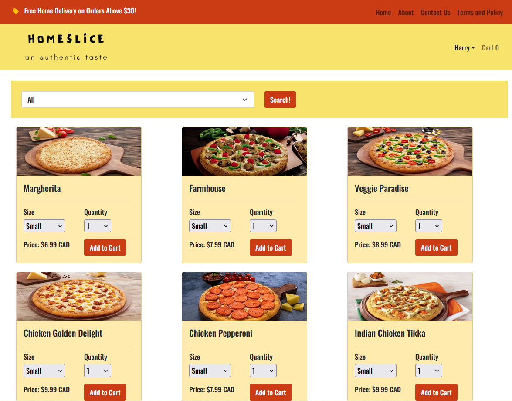
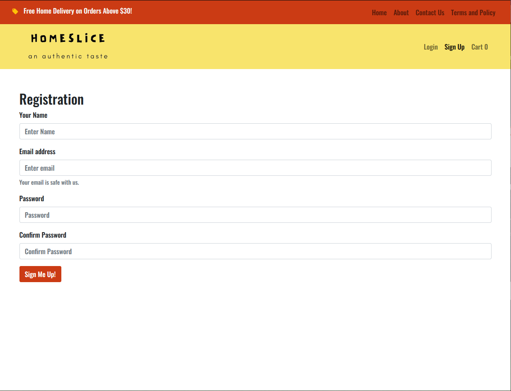
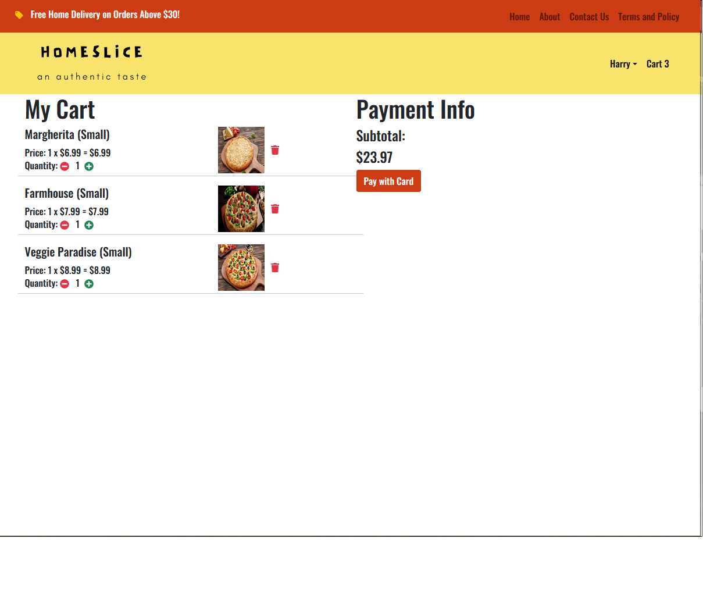
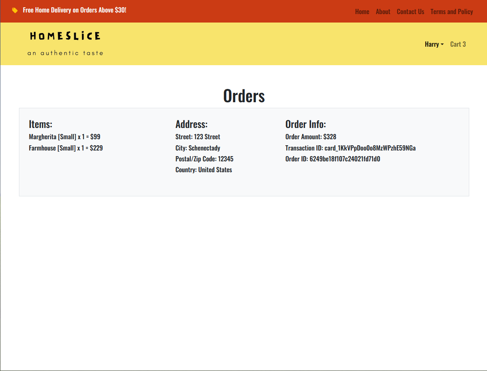

# Home Slice

## Description

  Home Slice is an independent pizza place with its own pizza-ordering application. It is a web-based application that stimulates the foodies (customers) by helping them to order their favorite pizzas through the internet.
  Home Slice greatly simplifies the ordering process for both the customer and the restaurant. The system presents an interactive and up-to-date menu with all available options in an easy to use manner. Customers can choose items to place an order which will land in the cart. Customers can view all the order details in the cart before checking out. At the end, the customer gets order confirmation details. Once the order is placed it is entered in the database and retrieved in real time. This allows restaurant employees to quickly go through the orders as they are received and process all orders efficiently and effectively with minimal delays and confusion.

> Github Repository Link: [https://github.com/Bickolus/home-slice](https://github.com/Bickolus/home-slice)
>
> Deployed App (Heroku) Link: [https://project-homeslice.herokuapp.com/](https://project-homeslice.herokuapp.com/)

## Table of Contents

1. [Installation](#installation)
2. [Usage](#usage)
3. [Example](#example)
4. [Technologies Used](#technologies-used)
5. [License](#license)
6. [Contributions/Questions](#contributionsquestions)

## Installation

Type "npm install" in the console to install the dependancies that this application requires. You would need to connect it to a MongoDB atlas cluster in order for the database stuff to be connected properly.

## Usage

Check out the deployed Heroku link if you wish to check out the application functionalities but do not want your own copy.

## Example

### Homepage

### Sign Up Page

### Cart Page

### Order Page

## Technologies Used 

* Axios
* MongoDB
* Mongoose
* Express
* Node.js
* React.js
* React Icons
* React Redux
* Redux Thunk
* React Bootstrap
* Stripe (React Stripe)
* Morgan

## License

This project is under the MIT License. 

## Contributions/Questions

These were the contributers for the application: 

* Alex Chang: (Github: [JotaroC](https://github.com/JotaroC), Email: cxz980314@gmail.com)
* Bilal Raza: (Github: [Bickolus](https://github.com/Bickolus), Email: smbraza97@gmail.com)
* Raman Singh: (Github: [ramriddlez](https://github.com/ramriddlez), Email: ramankangz@outlook.com)

If you have any additional questions about this application, please feel free to contact any of the members above.

